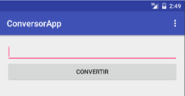

## Objetivo

Por defecto cuando creamos desde cero una actividad en blanco (Blank Activity) con el Android Studio, nos genera la página con una toolbar que muestra el label de la aplicación.



## Vista Default

La actividad principal define una toolbar

```xml
<android.support.design.widget.AppBarLayout
  android:id="@+id/app_bar"
  android:layout_width="match_parent"
  android:layout_height="wrap_content"
  android:theme="@style/AppTheme.AppBarOverlay">

  <LinearLayout
    android:layout_width="match_parent"
    android:layout_height="wrap_content">

    <android.support.v7.widget.Toolbar
      android:id="@+id/toolbar"
```

El id/toolbar se asigna en el método onCreate() al heredar de AppCompatActivity:

```kotlin
override fun onCreate(savedInstanceState: Bundle?) {
  super.onCreate(savedInstanceState)
  setContentView(R.layout.activity_pelicula_app_bar)

  val toolbar = findViewById(R.id.toolbar) as Toolbar
  setSupportActionBar(toolbar)
```

En nuestro AndroidManifest.xml definimos el label de la aplicación, mediante una indirección a una constante:

```xml
<activity
  android:name=".ConversorActivity"
  android:label="@string/app_name"
  >
```

Esa constante entonces, debemos verla en el archivo _res/values/strings.xml_:

```xml
<resources>
  <string name="app_name">ConversorApp</string> 
```

## Cambiando el título

Primero lo más sencillo: cambiaremos el nombre de la aplicación.

```xml
<resources>
  <string name="app_name">Conversor de medidas</string>
```

Otra opción es definir una nueva constante y apuntar la propiedad android:label de la activity principal de nuestra aplicación hacia esta constante, en todo caso dejamos esta tarea al lector.

## Agregando un ícono a nuestra aplicación

Si además queremos visualizar un ícono en la toolbar, debemos modificar el layout default 

- la toolbar ahora debe incluir
  - una imagen
  - y un textview con tamaño de título
- y debemos redefinir la asignación heredada en el método onCreate

Encontrar un ícono

La imagen debe tener un ícono, hay algunas opciones

- construirlo nosotros mediante algún programa open-source
- buscar un ícono de licencia libre en Internet

Vamos por la segunda opción, ingresamos a esta página y seleccionamos , por ejemplo, esta URL: cambiamos el color de fondo y al hacer Download zip vemos que tenemos el mismo png con diferentes tamaños en directorios especiales, uno para cada tipo de resolución:

Copiamos entonces el directorio res a nuestra aplicación:

1. abrimos el zip
2. extract ...
3. ... al directorio donde está la aplicación

Ahora sí generamos la ImageView y el TextView (activity_conversor.xml):

```xml
<android.support.v7.widget.Toolbar
  android:layout_width="match_parent"
  android:layout_height="?attr/actionBarSize"
  android:background="?attr/colorPrimary"
  app:popupTheme="@style/AppTheme.PopupOverlay">
<ImageView 
  android:layout_width="wrap_content"
  android:layout_height="wrap_content"
  android:src="@drawable/ic_action" />
<TextView
  android:id="@+id/toolbar"
  android:layout_width="wrap_content"
  android:layout_height="wrap_content" />
</android.support.v7.widget.Toolbar>
```

Hicimos un pequeño cambio: el id/toolbar se lo asignamos al TextView en lugar de a la toolbar.

Ejecutamos la aplicación y nos aparece un mensaje de error en el LogCat:

```bash
11-10 15:21:52.540 8720-8720/? E/AndroidRuntime:  Caused by: java.lang.ClassCastException: android.support.v7.widget.AppCompatTextView cannot be cast to android.support.v7.widget.Toolbar
11-10 15:21:52.540 8720-8720/? E/AndroidRuntime:     at org.uqbar.conversor.ConversorActivity.onCreate(ConversorActivity.java:23)
```

Ajustamos entonces el método onCreate, para asignar manualmente el valor del textview (_ConversorActivity.java_):

```kotlin
override fun onCreate(savedInstanceState: Bundle?) {
  super.onCreate(savedInstanceState)
  setContentView(R.layout.activity_pelicula_app_bar)

  val toolbar = findViewById(R.id.toolbar) as Toolbar
  setSupportActionBar(toolbar)
  toolbar.text = R.string.app_name
```

Ahora sí, se visualiza el ícono y el título:


Pero sería bueno que resaltara un poco más el título, para eso configuramos la propiedad textSize:

```xml
<TextView
  android:id="@+id/toolbar"
  android:layout_width="wrap_content"
  android:layout_height="wrap_content"
  android:textAppearance="?
  android:attr/textAppearanceLarge"/>
```

## Resultado final

Y vemos reflejado el cambio en la aplicación


