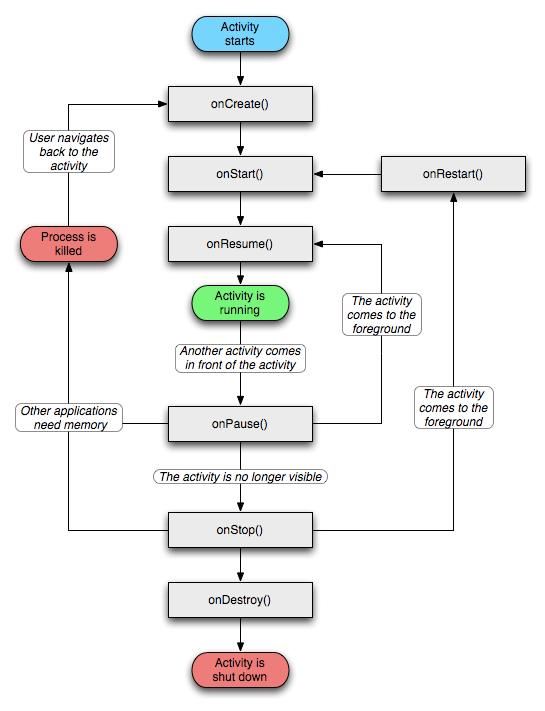
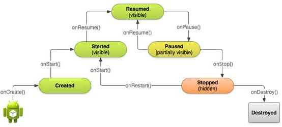

Si hablamos del ciclo de vida de las activities de una aplicación Android, tenemos dos diagramas que lo explican muy bien:

[Fuente](http://www.linuxtopia.org/online_books/android/devguide/guide/topics/fundamentals.html)

___

[Fuente](http://www.tutorialspoint.com/android/android_acitivities.htm)

Esto es importante tenerlo en cuenta para manejar la navegación entre las actividades, en especial cuando éstas comparten datos entre sí y se van solapando. Cuando hay actividades que consumen una gran cantidad de recursos, la VM guarda el estado de las actividades que están en segundo plano y las saca del stack de aplicaciones en memoria para luego volverlas a la vida cuando sea necesario. Esto implica definir cuál es ese estado que debe recuperarse o actualizarse cuando la actividad esté nuevamente disponible.
