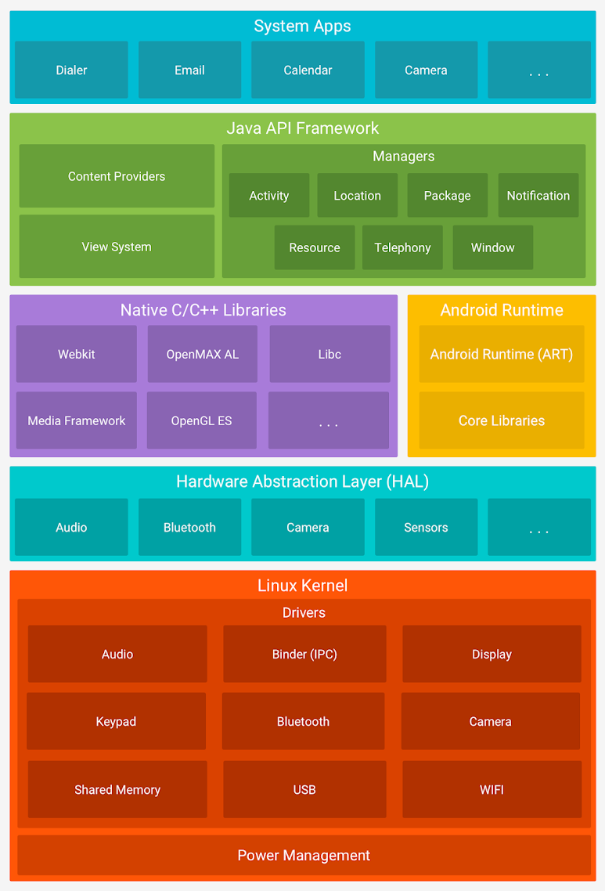
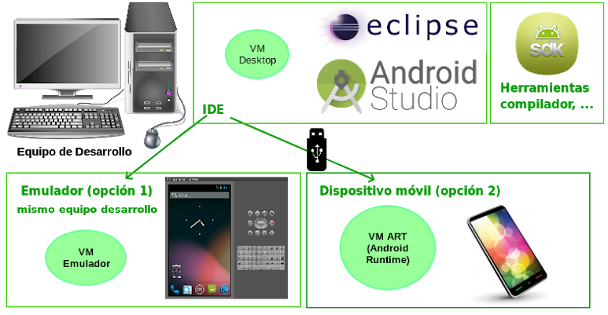
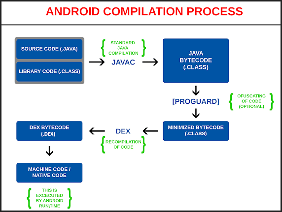
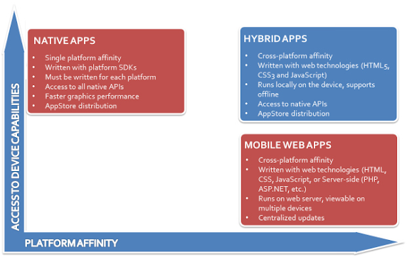
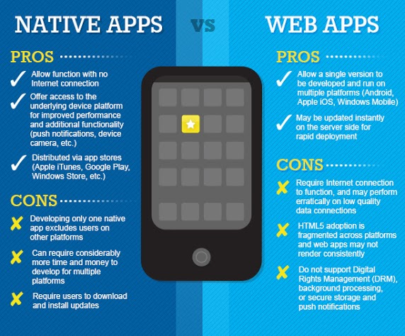

## Antes de comenzar

Si les interesa algo de historia, pueden revisar [la página de Wikipedia](http://en.wikipedia.org/wiki/Android_(operating_system))

## Qué es Android

Android es un conjunto de tecnologías _open source_ que vienen con

- un Sistema Operativo (Linux)
- una Virtual Machine (VM) hecha en Java que se llama Android Runtime (ART, anteriormente tenía el nombre [Dalvik](https://en.wikipedia.org/wiki/Dalvik_(software)))

sobre la cual corren aplicaciones. Funciona en dispositivos móviles, esto incluye teléfonos celulares, tablets, smart TVs, etc. 

La arquitectura incluye funciones de bajo, medio y alto nivel:

_En la figura aparecen los servicios ordenados arriba por los de más alto nivel y yendo hacia los de más bajo nivel (más cercanos al hardware del dispositivo)_

## Desarrollar en Android

Para desarrollar en Android, necesitás

- una **SDK** o Kit para desarrollar
- un **IDE**, que puede ser Android Studio (basado en IntelliJ IDEA) o bien el Eclipse con plugins
- un **entorno** (runtime) en el cual instalar y probar tus aplicaciones. Si no estás programando en un dispositivo móvil, hay una diferencia entre la VM en la que desarrollás y la VM en la que efectivamente corre la aplicación (por eso no vas a poder utilizar LocalDate, entre algunas otras cosas). Las opciones son
  - utilizar un emulador de dispositivos, como el **AVD: Android Virtual Device** (que promete ser más liviano que sus predecesores) o [**Genymotion**](https://www.genymotion.com/)
  - o bien conectar un dispositivo real con Android a tu máquina y deployar las aplicaciones en ese entorno.

Para más información podés ver esta página.

Algunas consecuencias que surgen

- es difícil el testeo de una aplicación
- aquí más que nunca es importante poder separar los componentes tecnológicos y los del negocio, que son más fáciles de testear en forma unitaria, aislada e independiente
- también tenemos que conocer las diferencias entre el emulador y el dispositivo real

## Tipos de Desarrollo en Android

Existen diferentes formas de desarrollar aplicaciones para dispositivos Android:

- **web adaptado** a dispositivos móviles
- **desarrollos híbridos**
- **desarrollos nativos**

Veamos a grandes rasgos de qué se trata cada una.

### Desarrollo web adaptado a mobile

Consiste en adaptar (o crear desde cero) una aplicación web, es decir HTML + CSS, pero teniendo en mente que va a ser utilizada desde un dispositivo móvil. Por ejemplo

- la vista puede tener una interfaz táctil
- la vista será más pequeña que una computadora de escritorio,
o bien que mientras en el escritorio la relación ancho:alto es 16:9, 4:3,- en el dispositivo móvil la pantalla suele tener por defecto disposición vertical (pantalla más alta que ancha), pero podríamos querer rotar a una disposición apaisada (portrait vs. landscape)

Para esto existen varias bibliotecas javascript específicas como:

- [Ionic](https://ionicframework.com/)
- [React Native](https://facebook.github.io/react-native/)
- [jQT](http://jqtjs.com/)
- [Sencha ExtJS](https://www.sencha.com/products/extjs/)

Además de las limitaciones propias de las aplicaciones web -cuya naturaleza es stateless- requiere estar permanentemente conectado a una red móvil para que la aplicación pueda funcionar: no hay ningún tipo de procesamiento local. Esto implica que al relegar toda la carga en el servidor

- se está desaprovechando las capacidades del dispositivo
- el servidor debe tener capacidad para soportar esa carga

Por otro lado, tiene las ventajas conocidas de las aplicaciones web: administración centralizada en el servidor, utiliza la misma tecnología para hacer una única aplicación. De todas maneras cabe destacar que el esfuerzo de adaptación en la interfaz no es menor y depende mucho del tipo de aplicación.

### Desarrollo nativo

En el desarrollo nativo se trabaja utilizando la misma tecnología que provee el dispositivo en el cual se trabaja, esto incluye no sólo iOS, Windows Phone, Android sino diferentes tipos de dispositivo y versiones de sistema operativo.

Mientras que esto acopla la aplicación a la plataforma utilizada, y requiere de un desarrollador especializado en esa tecnología, hay dos grandes ventajas al respecto:

- se aprovechan al máximo las capacidades y features de ese dispositivo
- es posible trabajar en forma local (offline) por un cierto tiempo y sincronizar la información entre cliente y servidor

Más adelante hablaremos de la forma de distribuir las aplicaciones.

### Desarrollo híbrido

En este tipo de desarrollo se trabaja en parte web y en parte con desarrollo nativo. También suelen incluirse en esta categoría los desarrollos generados con productos que soportan varias plataformas móviles (como [SAP Fiori](https://www.sap.com/products/fiori.trial.html#trial), o [Appcelerator](https://www.appcelerator.com/) que son libres y open source). Estos productos limitan los features a utilizar a favor de tener una única aplicación global para todas las plataformas.

[Fuente](http://blogthinkbig.com/aplicaciones-web-nativas-hibridas/)

## Comparación entre Arquitecturas

Este diagrama comparativo muestra pros y contras entre webmobile apps y aplicaciones nativas.

[Fuente](http://www.signalinc.com/choosing-the-right-technology-for-your-mobile-app-strategy/)

## Distribución de aplicaciones nativas

Uno de los grandes dolores de cabeza al construir aplicaciones de cliente rico es que tenían un alto costo la instalación y el posterior mantenimiento de versiones. Por ese motivo la mayoría de los vendedores desarrollaron el concepto de tienda donde se centraliza el deploy de las aplicaciones y la posterior instalación en cada uno de los clientes. Así tenemos Apple Store para iOS, Play Store para Android, Windows Store para Windows Phone, BlackBerry World, etc.

La publicación de nuestra aplicación en la tienda sigue un circuito de aprobación previo por parte de los proveedores de la plataforma (en algunos casos como Apple ese circuito puede transformarse en algo bastante burocrático, que incluya revisiones de código, el pago o la suscripción como desarrollador a esa plataforma, etc.)

La ventaja es que una vez lograda la publicación, la aplicación local del dispositivo se encarga de verificar si la aplicación soporta la versión del aparato, los temas de licenciamiento y la instalación en sí.
