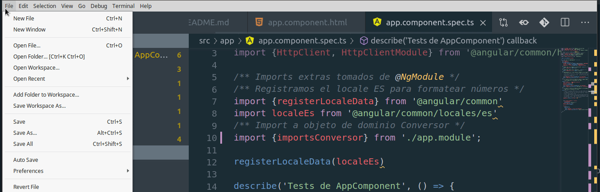

# Entorno

Es necesario que instales las siguientes herramientas, en este orden:

- Si estás en entorno Windows te recomendamos instalarte [Git Bash](https://gitforwindows.org/)
- Seguimos con [NodeJS](https://nodejs.org/en/), puede ser `lts/fermium -> v14.15.2` o la última que haya salido. Si estás en entorno Linux/Mac recomendamos que descargues Node desde [nvm (Node Version Manager)](https://github.com/nvm-sh/nvm)
- Luego [NPM (Node Package Manager)](https://www.npmjs.com/), con el que vamos a hacer los builds de nuestras aplicaciones.
  - Para familiarizarte con el manejo de dependencias, te dejamos [este artículo](npm-dependencias.html)  
- El [Angular CLI (Command line interface)](https://github.com/angular/angular-cli/blob/master/packages/angular/cli/README.md) se instala con npm:

```bash
npm install -g @angular/cli
```

# Editor de Texto

## Visual Studio Code

- El editor de texto que vamos a soportar en la cursada es [**Visual Studio Code**](https://code.visualstudio.com/) (hay [una versión portable](https://sourceforge.net/projects/vscode-portable/) si estás en una máquina sin privilegios de administrador).

Los plugins del Visual Studio Code que te recomendamos al 2021 son:

### Necesarios ###

- Path Intellisense (Christian Kohler): autocompletado para archivos de tu file system
- Auto Import (steoates): ayuda y autocompletado para importar componentes de JS
- Angular Files (Alexander Ivanichev): agrega un menú contextual para crear elementos de Angular
- JSON to TS (MariusAlchimavicius): te construye una interfaz de TS en base a la información de un JSON
- Angular Language Service (Angular): autocompletado dentro del template html
- Material Icon Theme (Philipp Kief)
- **Git Lens**, para ver el historial de Git integrado con tu Visual Studio Code

### Opcionales ###

- Import Cost (Wix): permite calcular cuántos KB pesa cada import
- Angular2-Switcher: agrega shortcuts para navegar entre .ts, .css, .html
- Angular2 Inline: syntax highlighting y autocompletado de código para componentes Angular inline (que tienen embebido html y css)
- REST Client: para hacer pedidos http desde Visual Studio Code directamente (podés usar POSTMAN, Insomnia o Swagger + navegador también)

### Configuraciones

A continuación te dejamos un video para mostrarte cómo configurar los plugins para que no exijan puntos y coma (`;`) al final de cada sentencia, algo que recomendamos.



Además, en tu proyecto, en el directorio raíz, vas a encontrar un archivo `tslint.json`, asegurate que tenga esta configuración:

```js
"semicolon": [
  false,
  "never"
],
```

## Alternativa a Visual Studio Code

Otra opción es utilizar [Web Storm](https://www.jetbrains.com/webstorm/) (de la suite de IntelliJ), si tienen una cuenta de la facultad pueden solicitar una licencia educativa. Solo que como no vamos a aprovechar todas las herramientas de este IDE poderoso quizás convenga ir por el Visual Studio Code.

# Aprendiendo Typescript

Typescript es el lenguaje de programación base para Angular. Tranquilo, es muy similar a los lenguajes orientados a objetos en los que ya trabajaste. Para iniciarte o para hacer consultas te dejamos estos links:

- [Documentación oficial de Typescript](https://www.typescriptlang.org/docs/home.html): tiene una intro de 5 minutos, otros tutoriales cortos y el Handbook para sacarse dudas
- [Aprendiendo Typescript en 30 minutos](https://tutorialzine.com/2016/07/learn-typescript-in-30-minutes): muy buen tutorial para comenzar explicando los conceptos más salientes
- [Tutorial de Typescript en castellano y PDF](https://www.gitbook.com/download/pdf/book/khru/typescript): material de consulta en castellano para los interesados
- El [cheatsheet](https://rmolinamir.github.io/typescript-cheatsheet/) o guía rápida para tener a mano mientras programan
- Y como typescript es un superconjunto de javascript, siempre conviene tener a mano las [funcionalidades de ES6](http://es6-features.org)
- **Tips**
  - [Typing destructured objects parameters](https://mariusschulz.com/blog/typing-destructured-object-parameters-in-typescript)

# Crear un proyecto Angular desde cero

En la consola Git Bash o bien desde una terminal de Linux hacemos

```bash
ng new nombre-de-tu-app
cd nombre-de-tu-app
ng serve -open  # o bien, la versión corta es ng s -o
```

# Correr los tests de un proyecto

Para ejecutar los tests de un proyecto, te posicionás en el directorio raíz y ejecutás desde la consola

```bash
ng test --watch --sourceMap=false
```

# Ejemplo de un archivo Travis

El siguiente es un ejemplo posible de un archivo `.travis.yml` para una aplicación Angular 8 (válido a octubre 2019):

```yml
sudo: required
dist: trusty
language: node_js
node_js:
  - '10.12'

addons:
apt:
  sources:
    - google-chrome
  packages:
    - google-chrome-stable
    - google-chrome-beta

before_install:
  - npm install -g npm@latest
  - export CHROME_BIN=chromium-browser
  - export DISPLAY=:99.0
  - sh -e /etc/init.d/xvfb start

before_script:

script: ng test --sourceMap=false --watch=false
```

Lo importante es que la versión de node que uses sea superior a 10.1
