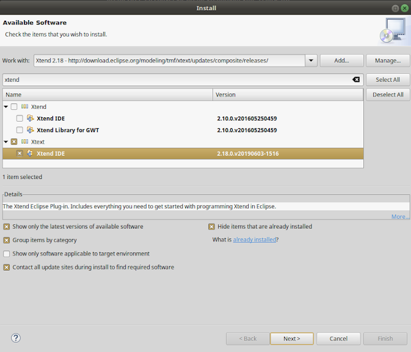

Para instalar el entorno de Arena en Xtend

- Necesitás una [**JDK (Java Development Kit) 1.8**](https://www.oracle.com/technetwork/java/javase/downloads/jdk8-downloads-2133151.html), no puede ser superior ya que no se lleva bien con el Class Loader de Arena.
- Recomendamos usar [**la última versión de Eclipse (2019-06) para Java**](https://www.eclipse.org/downloads/) (puede ser la versión anterior pero siempre es mejor trabajar con la última)
  - con el plugin Xtend 2.18 (el Update Site es http://download.eclipse.org/modeling/tmf/xtext/updates/composite/releases/)



- Y la [**última versión de Maven**](https://maven.apache.org/download.cgi) (no es tan importante que sea la última pero sí que sea 1.3.x)
- Si estás trabajando en Windows, descargate el [**Git Bash**](https://gitforwindows.org/)
- El archivo `.travis.yml` te lo podés bajar de cualquiera de nuestros ejemplos, o generalo desde cero con este contenido

```yml
dist: trusty

language: java
jdk:
  - oraclejdk8
```


## Links relacionados

- [Temario Algoritmos III](algo3-temario.html)
- [Configuración de Arena](arena-configuracion.html)
