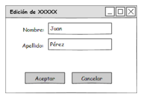

# Introducción

Si estamos modificando los datos de una entidad, es frecuente hacerlo en un formulario que tiene dos acciones posibles: aceptar o cancelar los cambios.

Los repositorios **persistentes** suelen encargarse del manejo de transacciones. En ese caso sería fácil predecir el comportamiento que tiene la ventana:

- cuando el usuario presiona el botón Aceptar se envía un mensaje a la home o repo para que actualice el objeto del formulario
- caso contrario no hago ninguna llamada, entonces el home actúa como un centralizador de las acciones sobre un repositorio común para todos los usuarios que acceden a la aplicación.

