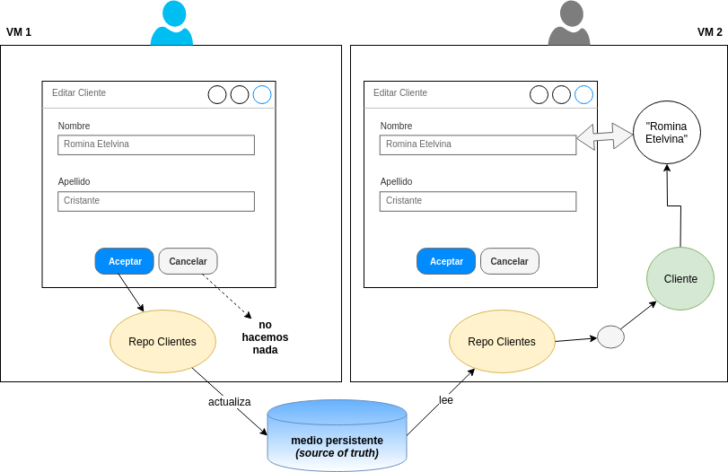

# Introducción

Si estamos modificando los datos de una entidad, es frecuente hacerlo en un formulario que tiene dos acciones posibles: aceptar o cancelar los cambios.

Cuando la UI tiene binding, cualquier modificación que haga el usuario impacta directamente en el modelo. ¿Qué alternativa tenemos entonces para volver atrás los cambios si el usuario desiste la acción?

# Sincronización mediante repositorios persistentes

Si estamos en un esquema distribuido, una opción puede ser que nuestro repositorio trabaje con un **medio persistente**, con dos objetivos:

- sincronizar la información de las distintas sesiones de usuario
- proveer un ambiente donde las operaciones son transaccionales (todas las actualizaciones ocurren al mismo tiempo o si falla alguna se cancelan las restantes)

En ese caso cuando el usuario presiona el botón Aceptar se envía un mensaje al repo para que actualice el objeto del formulario, caso contrario el repo no recibirá ninguna notificación. Cuando un usuario en otra VM diferente quiere actualizar el mismo cliente, el objeto repositorio toma la información del medio persistente para recrear los datos del cliente actualizados. El medio persistente actúa como "la única fuente de verdad", y mientras que los objetos que están en el ambiente son simplemente un _buffer_ o estado temporal antes de ser almacenados en el medio.

# Trabajo en una única VM con binding

Si en nuestra aplicación el repositorio considera la VM de objetos como la _single source of truth_, el mecanismo de binding puede traer efectos colaterales: cada vez que el usuario modifique el nombre, eso tiene un impacto inmediato en el objeto y tenemos que pensar en una estrategia si el usuario quiere cancelar la operación de edición.

 